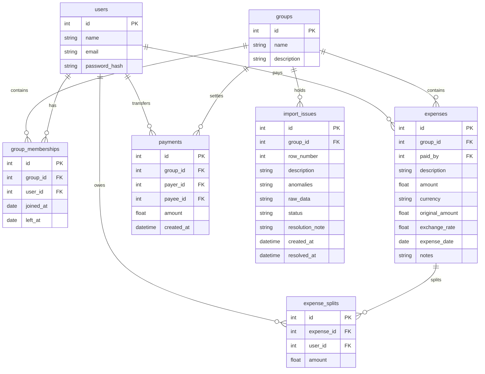

# SCOPE - CSV Anomaly Log & Database Schema

This document details the data import anomalies detected in `Expenses Export.csv` and outlines our application's database schema.

---

## CSV Anomaly Log

Our parser detects **15 distinct data problems** across the 42 rows of the spreadsheet export. Below is the log of these anomalies and how our interactive importer handles them:

| Anomaly ID | CSV Problem | Affected Row(s) | Detection Rule | Importer Correction Policy |
| :--- | :--- | :--- | :--- | :--- |
| **duplicate** | Duplicate record | Row 5 (Marina Bites) | Identical date, amount, payer, and split participants matching a previous row. | Proposes to **Ignore/Discard** the row (Meera's approval). |
| **overlapping_dinner** | Overlapping dinners logged by different users | Row 24 (Thalassa Dinner) | Similar description keywords ("thalassa") on the same date with different amounts. | Surfaces options to choose Rohan's Thalassa dinner (correct amount ₹2,450) and ignore Aisha's incorrect one (₹2,400). |
| **name_typo** | lowercase name or variations | Row 10 (Priya S), Row 8 (priya), Row 26 (rohan) | Casing differences or name extensions not in standard flatmate list. | Normalizes strings (`.strip().title()`) and maps `Priya S` to `Priya`. |
| **missing_payer** | Empty payer field | Row 12 (House supplies) | `paid_by` column is empty. | Prompts user to select from group members (e.g. choose Rohan). |
| **bad_amount_format** | String commas/quotes in amount | Row 6 (Electricity Feb) | Regex match on quotes or commas in the amount value (`"1,200"`). | Strips quotes and commas; parses as a float (`1200.0`). |
| **decimal_places** | Extra decimal places | Row 9 (Cylinder refill) | Value has more than 2 decimal places (`899.995`). | Auto-rounds mathematically to 2 decimal places (`900.00`). |
| **zero_amount** | Zero amount | Row 30 (Swiggy Dinner) | Amount is exactly `0`. | Proposes to ignore or let the user input the correct amount. |
| **negative_amount** | Negative amount refund | Row 25 (Parasailing refund) | Amount is `< 0` (`-30` USD). | Imports as a negative split refund, decreasing the net amount each participant owes. |
| **missing_currency** | Empty currency field | Row 27 (Groceries DMart) | `currency` field is blank. | Proposes defaulting to the group's default currency (`INR`). |
| **foreign_currency** | USD currency | Rows 19, 20, 22, 25 | `currency == "USD"`. | Proposes conversion to INR at configured rate (default `83.0`) and stores both original USD details and converted INR amount (Priya's request). |
| **possible_settlement** | Settlement logged as expense | Row 13 (Rohan paid Aisha), Row 37 (Sam deposit) | Description contains "paid back", "settle", "deposit". | Proposes importing as a direct `Payment` (settlement) rather than an `Expense` to avoid doubling debt. |
| **percentage_total_mismatch** | Split percentages != 100% | Row 14 (Pizza), Row 31 (Brunch) | Sum of split percentages != 100 (e.g. 110%). | Proposes normalized splits (scaling to 100%) or manual correction. |
| **split_details_inconsistent** | Details in equal split | Rows 21 (Scooter), Row 34 (April rent), Row 41 (Furniture) | `split_type == "equal"` or `split_type == "share"` but details are provided anyway. | Imports based on split details weights/shares (resolves to correct ratio). |
| **inactive_member** | Inactive member in split | Row 35 (Meera on Apr 2) | Expense date falls outside member's active period (Meera left Mar 31). | Flags member as inactive. Proposes removing Meera and splitting between active members (Sam's request). |
| **unknown_participant** | Guest in split | Row 22 (Parasailing) | Participant name (Kabir) is not in the group. | Flags Kabir. Proposes assigning Kabir's split share to his inviter Dev. |

---

## Database Schema

### Table Details

1. **`users`**: Stores user credentials. `password_hash` is nullable to facilitate mock logins and automated test seeding.
2. **`groups`**: Splitwise groups.
3. **`group_memberships`**: Maps users to groups dynamically over time. `joined_at` and `left_at` date ranges dictate membership eligibility.
4. **`expenses`**: Stores expense items. `amount` stores the normalized INR cost. `currency`, `original_amount`, and `exchange_rate` track the original foreign transaction metrics for complete transparency.
5. **`expense_splits`**: Links members to their specific owed share in INR for a given expense.
6. **`payments`**: Captures settlements. Payer transfers direct amount to payee.
7. **`import_issues`**: Staging area for dirty CSV rows. Contains columns for raw data, anomaly flags, status (`pending`/`resolved`), and the resolution note.
